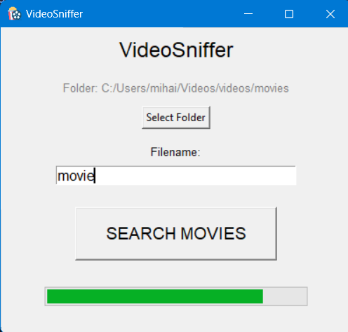
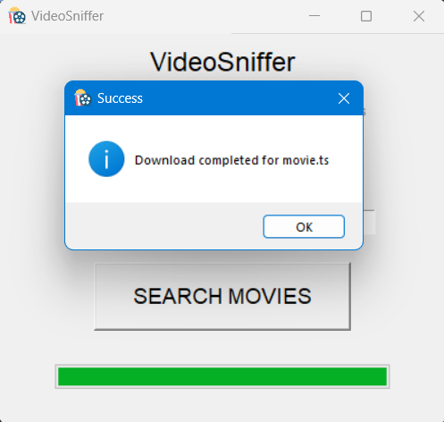

# video-sniffer
This is a project for ICEF python course. Here we attempted to create an API that is able to transfer a video from your ram memory to you hard memory. This API allow user to download video from browser.

<ul>
  <li>For nerds: git clone the project and setup using pyproject.toml and run python src/run.py to open tkinter UI</li>
  <li>For people: Simply download videosniffer.exe and enjoy films</li>
</ul>
<h4>Guide how to use</h4>

<ol>
  <li>Open app videosniffer.exe and allow execution on Windows. No malware :D I promise</li>
  <li>When the window pops up, we will have all of your data stolen</li>
  <li>Select folder to output videos to and specify the name of the file without extension</li>
  <li>Then click <b>Search Movies</b> button, this will redirect you to lordsfilm website where you should choose the film you want to watch</li>
  <li>Once you are on the film page, select the <b>3rd player (Плеер 3)</b> and and start the video</li>
  <li>After watching Ads, choose quality you want in the mediaplayer and dubbing and close the browser. This will start the download</li>
</ol>

  

  

